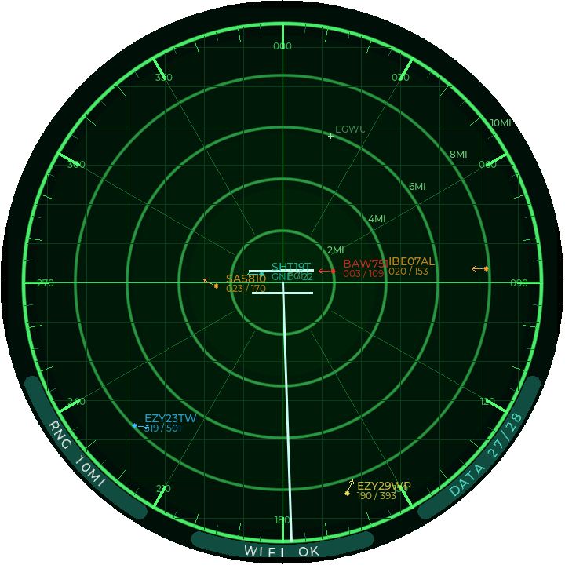
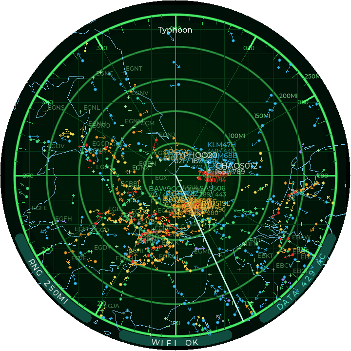
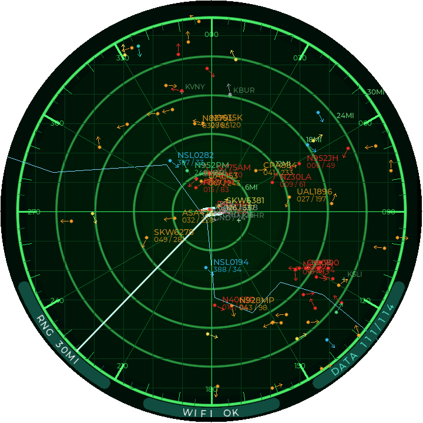
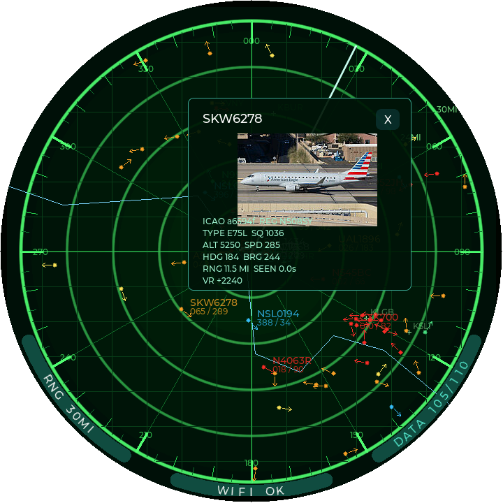
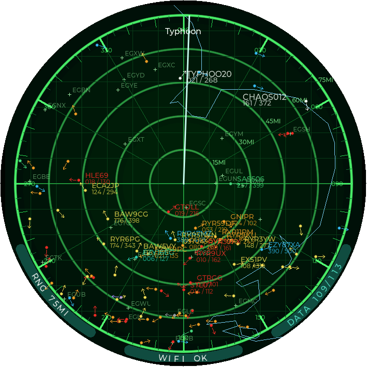

# ADSB Radar

ADSB Radar is ESP-IDF firmware for a round, radar-style aircraft display running
on the Waveshare ESP32-P4-WIFI6-Touch-LCD-XC. It turns the 4-inch 720x720 touch
screen into a small live traffic display: aircraft are fetched over WiFi,
projected around a configurable centre point, coloured by altitude, and drawn
with callsign, flight level, speed, heading, climb/descent state, airports,
country outlines, and optional runway geometry.

The device is intended to run by itself once configured. WiFi credentials,
location, data source, visual styling, notification rules, range presets, API
keys, and display preferences are all stored on the ESP32. Day-to-day changes
are made through the built-in browser admin page, while the radar itself remains
usable from the touch screen.

## Screenshots

| Live airport view | Wide-area traffic view |
| --- | --- |
|  |  |
| Centred on London Heathrow, showing close-range aircraft, airport context, range rings, heading arrows, and the sweep line. | A 250-mile regional view with country outlines, altitude-coloured aircraft, dense traffic, and range labels. |

| Busy terminal area | Aircraft detail popup |
| --- | --- |
|  |  |
| Los Angeles terminal traffic with coastline overlay, airport markers, altitude colouring, and aircraft labels. | Touching an aircraft opens a detail popup with aircraft metadata and a PlaneSpotters thumbnail when one is available. |

| Country boundary overlay |
| --- |
|  |
| Country outlines can be drawn subtly behind the radar data, giving extra context without hiding aircraft. |

The project is configured for the 4-inch 720x720 display variant:

- `CONFIG_BSP_LCD_TYPE_720_720_4_INCH=y`
- ESP32-P4 target
- Waveshare ESP32-P4 WiFi 6 Touch LCD XC BSP
- LVGL 9 user interface

Waveshare hardware documentation:

- [ESP32-P4-WIFI6-Touch-LCD-XC product docs](https://docs.waveshare.com/ESP32-P4-WIFI6-Touch-LCD-XC)
- [Waveshare ESP-IDF setup guide](https://docs.waveshare.com/ESP32-P4-WIFI6-Touch-LCD-XC/Development-Environment-Setup-IDF)

## Features

- Full-screen radar drawn for the round 4-inch 720x720 LCD.
- Live aircraft data from Airplanes.live, ADSB.lol, ADSB.fi, or a local
  `aircraft.json` feed such as readsb or dump1090.
- Touch-screen range control with up to ten configurable ranges, refresh
  intervals, and label limits.
- Aircraft symbols coloured by altitude, with optional emergency squawk
  highlighting.
- Callsign and flight-level/speed labels, including configurable aircraft label
  font and size.
- Heading arrows, plus optional climb/descent triangles beside the flight level.
- Aircraft filtering from the radar DATA menu: all aircraft, military aircraft,
- Aircraft detail popup from touch selection, with optional PlaneSpotters photo
  thumbnails where available.
- Notification rules for aircraft type matches, including per-rule colour,
  enabled state, bold labels, and radar banner text.
- Airport markers generated from `data/airports.csv`, with airport search for
  setting the radar centre.
- Optional country boundary overlay generated from `data/world.geojson`.
- Optional runway overlay when the radar is centred on an airport, using
  AirportDB with cached, rate-limited API calls.
- Captive portal for first-time WiFi setup and a radar WiFi menu for IP address,
  changing WiFi, and rebooting the device.
- Browser-based Bootstrap admin page with Location, Data Sources, Display,
  Notifications, Ranges, WiFi, and Status sections.
- Display controls for colours, line widths, visibility, label fonts and sizes,
  tick lengths, radial spacing, sweep step, and sweep draw interval.
- Status pages for memory, heap low-water marks, caches, WiFi, GPS, data source,
  and the full aircraft list.
- Optional USB GPS support for the radar centre, including GPS status and a
  button to copy the current GPS fix into the manual position fields.

## Required Hardware

Required:

- Waveshare ESP32-P4-WIFI6-Touch-LCD-XC, 4-inch 720x720 version.
- USB cable for flashing, power, and serial monitor.
- A WiFi network with internet access.
- A development machine running Linux, macOS, or Windows.

Optional:

- USB GPS receiver connected to the board USB-A port.
- AirportDB API token if you want runway drawing. AirportDB requires
  registration at [airportdb.io](https://airportdb.io) and the free API limit is
  5000 calls per month.
- OpenWeather API key if you want to search for the radar centre by place name.
- A local ADS-B receiver if you prefer to use a local `aircraft.json` feed
  instead of an internet aircraft API.

This firmware is not configured for the 3.4-inch 800x800 variant. That display
would need a different BSP LCD Kconfig selection and UI layout review.

## Software Required

Install:

- ESP-IDF. This project has been built with ESP-IDF `v5.5.2`.
- Python 3.
- Git.
- CMake and Ninja. These are normally installed by the ESP-IDF tools installer.
- VS Code with the Espressif IDF extension, optional but useful.

The ESP-IDF extension is enough if it is configured to use a working ESP-IDF
installation and can run `idf.py` tasks. The command line examples below are the
same operations the extension performs.

## Project Layout

```text
.
|-- CMakeLists.txt
|-- data/
|   |-- airports.csv
|   `-- world.geojson
|-- main/
|   |-- app/
|   |-- aircraft/
|   |-- airports/
|   |-- core/
|   |-- gps/
|   |-- net/
|   |-- settings/
|   |-- ui/
|   `-- wifi/
|-- tools/
|   |-- generate_airports.py
|   `-- generate_boundaries.py
|-- components/
|-- main/idf_component.yml
|-- dependencies.lock
|-- partitions.csv
|-- sdkconfig
`-- sdkconfig.defaults
```

`data/airports.csv` and `data/world.geojson` are build inputs. The generated C++
files are written into the build directory and should not be committed.

`managed_components/` is downloaded by ESP-IDF Component Manager and is ignored
by Git.

## Clone And Open

```bash
git clone <your-repo-url> radar
cd radar
```

If you are using VS Code, open this folder and select the ESP-IDF extension
environment for ESP-IDF `v5.5.2` or another compatible ESP-IDF 5.x install.

## Configure ESP-IDF

From a shell:

```bash
. ~/esp/esp-idf-v5.5.2/export.sh
```

Adjust the path to match your ESP-IDF installation. If ESP-IDF is installed
somewhere else, use that full path instead.

Set the target:

```bash
idf.py set-target esp32p4
```

The project already includes `sdkconfig` and `sdkconfig.defaults`. If you need to
regenerate local config from defaults:

```bash
idf.py fullclean
idf.py set-target esp32p4
idf.py reconfigure
```

## Build

```bash
. ~/esp/esp-idf-v5.5.2/export.sh
idf.py build
```

During the build:

- ESP-IDF downloads managed dependencies into `managed_components/`.
- `tools/generate_airports.py` converts `data/airports.csv` into generated C++.
- `tools/generate_boundaries.py` converts `data/world.geojson` into generated C++.
- The final firmware is written to `build/radar_console.bin`.

The build output should end with something like:

```text
Project build complete.
```

## Flash

Connect the board to the development machine using the USB programming port.

Find the serial port:

```bash
ls /dev/ttyACM* /dev/ttyUSB*
```

On this board the USB serial device may appear as `QinHeng Electronics USB
Single Serial`, usually mapped to something like `/dev/ttyACM0` or `/dev/ttyUSB0`.

Flash and monitor:

```bash
. ~/esp/esp-idf-v5.5.2/export.sh
idf.py -p /dev/ttyACM0 flash monitor
```

Replace `/dev/ttyACM0` with the port on your machine.

If flashing cannot connect, put the ESP32-P4 into download mode:

1. Hold `BOOT`.
2. Press and release `RESET`.
3. Release `BOOT` after the flash command starts connecting.

Exit the serial monitor with `Ctrl+]`.

## First Boot And WiFi Setup

On first boot, or when no saved WiFi credentials exist, the device starts a
captive portal.

1. On a phone or computer, connect to the WiFi network shown on the radar screen.
   It is normally named `RadarSetup-XXXX`.
2. Open `http://192.168.4.1`.
3. Select your WiFi network and enter its password.
4. Save. The ESP32 stores the credentials and reconnects automatically.

After the device has joined your WiFi network, the radar screen shows the current
status on the WiFi menu. Use the WiFi button on the radar to view the IP address,
restart captive portal mode, or reboot the ESP32.

## Browser Admin

When the radar is connected to WiFi, open the device IP address in a browser.

The admin page is split into tabs:

- Location: set the radar centre manually, from USB GPS, from an airport, or by
  searching for a place through OpenWeather. This tab also sets the startup
  range.
- Data Sources: choose Airplanes.live, ADSB.lol, ADSB.fi, or a local aircraft
  feed. This is also where the AirportDB and OpenWeather API keys are stored.
- Display: control radar layers, aircraft headings, ground aircraft display,
  sweep timing, label fonts and sizes, colours, line widths, tick lengths,
  radial spacing, and altitude colour bands.
- Notifications: configure up to ten aircraft type rules. A match can colour the
  aircraft, force its label to remain visible, display banner text on the radar,
  and optionally use a bolder label.
- Ranges: configure up to ten range presets. Each preset has its own range,
  aircraft refresh interval, and maximum number of labels.
- WiFi: scan for networks and store WiFi credentials.
- Status: view device memory, heap, cache use, WiFi state, GPS state, fetch
  status, and the full aircraft table. The aircraft table uses DataTables search
  and groups aircraft by whether they are currently on the radar display.

Settings are stored in NVS on the ESP32 and are applied to the radar after they
are saved.

## Data Sources

The built-in internet aircraft feeds use the configured radar centre and range.
Ranges are entered in statute miles on the device, then converted where the
upstream API expects nautical miles.

Airplanes.live:

```text
https://api.airplanes.live/v2/point/{lat}/{lon}/{range_nm}
```

ADSB.lol:

```text
https://api.adsb.lol/v2/point/{lat}/{lon}/{range_nm}
```

ADSB.fi:

```text
https://opendata.adsb.fi/api/v3/lat/{lat}/lon/{lon}/dist/{range_nm}
```

ADSB.fi open data is documented at <https://github.com/adsbfi/opendata>.
Their public endpoint is for personal, non-commercial use and is rate limited,
so keep the range refresh intervals sensible.

Local receiver mode expects a readsb/dump1090-style JSON document, for example:

```text
http://192.168.1.28:8080/data/aircraft.json
```

Aircraft photos:

```text
https://api.planespotters.net/pub/photos/hex/{icao_hex}
```

The app adds browser-like headers and serialises HTTPS operations so aircraft
data and photo downloads do not overlap at the TLS layer.

Airport runways:

```text
https://airportdb.io/api/v1/airport/{ICAO}?apiToken={apiToken}
```

Runway drawing is optional. It is only enabled when the radar is centred on an
airport and an AirportDB API token has been saved in settings.
[AirportDB](https://airportdb.io) requires registration and the free API limit is
5000 calls per month. The firmware caches and rate-limits AirportDB requests to
avoid wasting that quota.

## GPS

Optional USB GPS support is built in.

Connect a USB GPS receiver to the board USB-A port. In settings, choose GPS as
the radar centre source. The settings page reports GPS status, including whether
the receiver is connected, whether NMEA data is being received, and whether a fix
is available.

You can also copy the current GPS position into the manual radar centre fields.

## Useful Commands

Clean build artifacts:

```bash
idf.py fullclean
```

Reconfigure after changing Kconfig or component files:

```bash
idf.py reconfigure
```

Open menuconfig:

```bash
idf.py menuconfig
```

Build, flash, and monitor in one command:

```bash
idf.py -p /dev/ttyACM0 build flash monitor
```

## Git Notes

Commit these files:

- Source under `main/`
- Data under `data/`
- Generators under `tools/`
- `components/bsp_extra/`
- `components/waveshare__esp32_p4_wifi6_touch_lcd_xc/`
- `main/idf_component.yml`
- `dependencies.lock`
- `sdkconfig`
- `sdkconfig.defaults`
- `partitions.csv`

Do not commit:

- `build/`
- `managed_components/`
- editor swap files
- local SDK config backups

The `.gitignore` file is set up for this.

## Troubleshooting

No serial port:

- Check the USB cable supports data.
- Try another USB port.
- On Linux, check `dmesg` after plugging in the board.
- Add your user to the serial group if required, for example `dialout` on Debian
  or Raspberry Pi OS.

Build fails after moving files or changing data:

```bash
idf.py fullclean
idf.py build
```

WiFi setup portal does not appear:

- Reboot the ESP32.
- Use the radar WiFi menu to start captive portal mode.
- Connect directly to the displayed `RadarSetup-XXXX` network and open
  `http://192.168.4.1`.

Aircraft data is stale:

- Check that the ESP32 has joined WiFi.
- Check the configured radar centre and range.
- Confirm the WiFi network has internet access and allows HTTPS.

Runways are not displayed:

- Confirm the radar centre source is an airport.
- Confirm an AirportDB API token is saved in settings. Register at
  [airportdb.io](https://airportdb.io) if you do not have one.
- Confirm runway drawing is enabled in settings.
